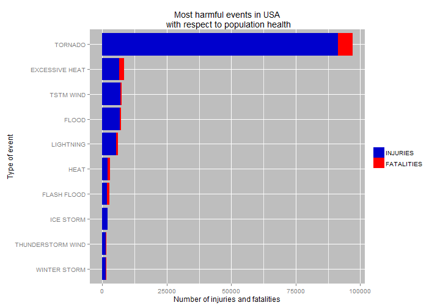
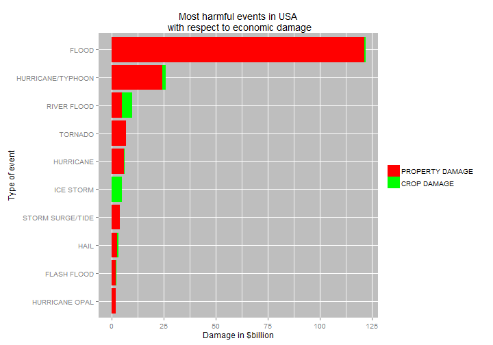

Impact of weather events on population health and economy across the United States from 1950 to 2011
-------------------------------------------------------------------------------------------------------
### Synopsis  
This report aims to answer two questions about weather events and their impact across the US from 1950 to november 2011.  
Questions are:  
1. Across the United States, which types of events (as indicated in the EVTYPE variable) are most harmful with respect to population health?  
2. Across the United States, which types of events have the greatest economic consequences?  
Data that was used for answering these questions were obtained from National Weather Service.  

##  
### Data Processing  

##  
Downloading raw data.

```r
library(R.utils)
if (!file.exists("storm_data.csv.bz2")){
        fileURL <- "https://d396qusza40orc.cloudfront.net/repdata%2Fdata%2FStormData.csv.bz2"
        download.file(fileURL, "storm_data.csv.bz2")
        bunzip2("storm_data.csv.bz2", "storm_data.csv", remove = F, skip = T)
}
```

##  
Loading necessary libraries.

```r
library(dplyr)
library(reshape2)
library(ggplot2)
```

##  
#### Reading in storm data

```r
storm_data <- read.csv("storm_data.csv", stringsAsFactors = F, na.strings = "?")
```

##  
Checking properties and content of data frame.

```r
str(storm_data)
```

```
## 'data.frame':	902297 obs. of  37 variables:
##  $ STATE__   : num  1 1 1 1 1 1 1 1 1 1 ...
##  $ BGN_DATE  : chr  "4/18/1950 0:00:00" "4/18/1950 0:00:00" "2/20/1951 0:00:00" "6/8/1951 0:00:00" ...
##  $ BGN_TIME  : chr  "0130" "0145" "1600" "0900" ...
##  $ TIME_ZONE : chr  "CST" "CST" "CST" "CST" ...
##  $ COUNTY    : num  97 3 57 89 43 77 9 123 125 57 ...
##  $ COUNTYNAME: chr  "MOBILE" "BALDWIN" "FAYETTE" "MADISON" ...
##  $ STATE     : chr  "AL" "AL" "AL" "AL" ...
##  $ EVTYPE    : chr  "TORNADO" "TORNADO" "TORNADO" "TORNADO" ...
##  $ BGN_RANGE : num  0 0 0 0 0 0 0 0 0 0 ...
##  $ BGN_AZI   : chr  "" "" "" "" ...
##  $ BGN_LOCATI: chr  "" "" "" "" ...
##  $ END_DATE  : chr  "" "" "" "" ...
##  $ END_TIME  : chr  "" "" "" "" ...
##  $ COUNTY_END: num  0 0 0 0 0 0 0 0 0 0 ...
##  $ COUNTYENDN: logi  NA NA NA NA NA NA ...
##  $ END_RANGE : num  0 0 0 0 0 0 0 0 0 0 ...
##  $ END_AZI   : chr  "" "" "" "" ...
##  $ END_LOCATI: chr  "" "" "" "" ...
##  $ LENGTH    : num  14 2 0.1 0 0 1.5 1.5 0 3.3 2.3 ...
##  $ WIDTH     : num  100 150 123 100 150 177 33 33 100 100 ...
##  $ F         : int  3 2 2 2 2 2 2 1 3 3 ...
##  $ MAG       : num  0 0 0 0 0 0 0 0 0 0 ...
##  $ FATALITIES: num  0 0 0 0 0 0 0 0 1 0 ...
##  $ INJURIES  : num  15 0 2 2 2 6 1 0 14 0 ...
##  $ PROPDMG   : num  25 2.5 25 2.5 2.5 2.5 2.5 2.5 25 25 ...
##  $ PROPDMGEXP: chr  "K" "K" "K" "K" ...
##  $ CROPDMG   : num  0 0 0 0 0 0 0 0 0 0 ...
##  $ CROPDMGEXP: chr  "" "" "" "" ...
##  $ WFO       : chr  "" "" "" "" ...
##  $ STATEOFFIC: chr  "" "" "" "" ...
##  $ ZONENAMES : chr  "" "" "" "" ...
##  $ LATITUDE  : num  3040 3042 3340 3458 3412 ...
##  $ LONGITUDE : num  8812 8755 8742 8626 8642 ...
##  $ LATITUDE_E: num  3051 0 0 0 0 ...
##  $ LONGITUDE_: num  8806 0 0 0 0 ...
##  $ REMARKS   : chr  "" "" "" "" ...
##  $ REFNUM    : num  1 2 3 4 5 6 7 8 9 10 ...
```

##  
Taking a look in variable EVTYPE to see some names and number of different event types and to check if there is any missing values.

```r
head(unique(storm_data$EVTYPE))
```

```
## [1] "TORNADO"               "TSTM WIND"             "HAIL"                 
## [4] "FREEZING RAIN"         "SNOW"                  "ICE STORM/FLASH FLOOD"
```

```r
length(unique(storm_data$EVTYPE))
```

```
## [1] 985
```

```r
sum(is.na(storm_data$EVTYPE))
```

```
## [1] 1
```

##  
In the next lines, storm data is processed in order to answer the first question relating to health.  
Key variables are FATALITIES and INJURIES.

```r
harmful <- tbl_df(aggregate(cbind(FATALITIES, INJURIES) ~ EVTYPE, storm_data, FUN = "sum"))

# creating new variable that is the sum of FATALITIES and INJURIES
harmful <- mutate(harmful, FATALITIES_N_INJURIES = FATALITIES + INJURIES)

# data is ordered by the sum of FATALITIES and INJURIES
harmful <- arrange(harmful, desc(FATALITIES_N_INJURIES))
```

##  
Getting the first 10 most harmful events and melting for easier handling.

```r
harmful_melt <- melt(harmful[1:10, c("EVTYPE", "INJURIES", "FATALITIES")], id.vars = 1)
```

##  
Key variables for answering second question relating to impact on economy are PROPDMG, PROPDMGEXP, CROPDMG, CROPDMGEXP that corespond to property and crop damage in dollars.  
According to National Weather Service, PROPDMGEXP and CROPDMGEXP should contain symbols representing weather the cost is in billions, millions or thousands. Let's take a look.

```r
unique(storm_data$PROPDMGEXP)
```

```
##  [1] "K" "M" ""  "B" "m" "+" "0" "5" "6" NA  "4" "2" "3" "h" "7" "H" "-"
## [18] "1" "8"
```

```r
unique(storm_data$CROPDMGEXP)
```

```
## [1] ""  "M" "K" "m" "B" NA  "0" "k" "2"
```

```r
# those variables need to be cleaned 
```

##  
Next lines depict processing of storm data for answering the second question

```r
selected_econ <- storm_data[, c("EVTYPE", "PROPDMG", "PROPDMGEXP", "CROPDMG", "CROPDMGEXP")]
```


```r
multiply <- as.data.frame(cbind(c("H", "K", "M", "B", "h", "k", "m", "b", 0:8, ""), 
               c(rep(c(100, 1000, 100000, 1000000000), 2), "^"(10, 0:8), NA)))

multiply[, 1] # symbols that should be replaced
```

```
##  [1] H K M B h k m b 0 1 2 3 4 5 6 7 8  
## Levels:  0 1 2 3 4 5 6 7 8 b B h H k K m M
```

```r
multiply[, 2] # symbols to replace with
```

```
##  [1] 100   1000  1e+05 1e+09 100   1000  1e+05 1e+09 1     10    100  
## [12] 1000  10000 1e+05 1e+06 1e+07 1e+08 <NA> 
## Levels: 1 10 100 1000 10000 1e+05 1e+06 1e+07 1e+08 1e+09
```

##  
Substituting previously shown symbols with integers

```r
selected_econ <- selected_econ[which(selected_econ$PROPDMGEXP %in% multiply[1:17, 1] |
                                     selected_econ$CROPDMGEXP %in% multiply[1:17, 1]), ] 

# fatorizing and subtituting 
selected_econ$PROPDMGEXP <- factor(selected_econ$PROPDMGEXP, 
                                   levels = multiply[, 1], labels = multiply[, 2])
```

```
## Warning in `levels<-`(`*tmp*`, value = if (nl == nL) as.character(labels)
## else paste0(labels, : duplicated levels in factors are deprecated
```

```r
selected_econ$CROPDMGEXP <- factor(selected_econ$CROPDMGEXP, 
                                   levels = multiply[, 1], labels = multiply[, 2])
```

```
## Warning in `levels<-`(`*tmp*`, value = if (nl == nL) as.character(labels)
## else paste0(labels, : duplicated levels in factors are deprecated
```

##  
Cleaning data

```r
selected_econ <- tbl_df(selected_econ)

# creating new variables Property_damage and Crop_damage that hold real values in dollars
selected_econ <- mutate(selected_econ, Property_damage = PROPDMG * 
                                 as.numeric(as.character(PROPDMGEXP)),
                         Crop_damage = CROPDMG * as.numeric(as.character(CROPDMGEXP)))

economic <- aggregate(cbind(Property_damage, Crop_damage) ~ EVTYPE, selected_econ, FUN = "sum")

# creating new variable Total_damage that is sum of previously created variables
economic <- mutate(economic, Total_damage = Property_damage + Crop_damage)

#data is arranged by the Total_damage
economic <- arrange(economic, desc(Total_damage))
```

##  
Melting data

```r
economic_melt <- melt(economic[1:10, c("EVTYPE", "Property_damage", "Crop_damage")], 
                      id.vars = 1)
```


### Results

##  
Most harmful events with respect to population health - table

```r
xt1 <- xtable::xtable(as.data.frame(harmful[1:10, ]))
print(xt1, type = "html")
```

<!-- html table generated in R 3.2.2 by xtable 1.8-0 package -->
<!-- Wed Nov 18 00:50:27 2015 -->
<table border=1>
<tr> <th>  </th> <th> EVTYPE </th> <th> FATALITIES </th> <th> INJURIES </th> <th> FATALITIES_N_INJURIES </th>  </tr>
  <tr> <td align="right"> 1 </td> <td> TORNADO </td> <td align="right"> 5633.00 </td> <td align="right"> 91346.00 </td> <td align="right"> 96979.00 </td> </tr>
  <tr> <td align="right"> 2 </td> <td> EXCESSIVE HEAT </td> <td align="right"> 1903.00 </td> <td align="right"> 6525.00 </td> <td align="right"> 8428.00 </td> </tr>
  <tr> <td align="right"> 3 </td> <td> TSTM WIND </td> <td align="right"> 504.00 </td> <td align="right"> 6957.00 </td> <td align="right"> 7461.00 </td> </tr>
  <tr> <td align="right"> 4 </td> <td> FLOOD </td> <td align="right"> 470.00 </td> <td align="right"> 6789.00 </td> <td align="right"> 7259.00 </td> </tr>
  <tr> <td align="right"> 5 </td> <td> LIGHTNING </td> <td align="right"> 816.00 </td> <td align="right"> 5230.00 </td> <td align="right"> 6046.00 </td> </tr>
  <tr> <td align="right"> 6 </td> <td> HEAT </td> <td align="right"> 937.00 </td> <td align="right"> 2100.00 </td> <td align="right"> 3037.00 </td> </tr>
  <tr> <td align="right"> 7 </td> <td> FLASH FLOOD </td> <td align="right"> 978.00 </td> <td align="right"> 1777.00 </td> <td align="right"> 2755.00 </td> </tr>
  <tr> <td align="right"> 8 </td> <td> ICE STORM </td> <td align="right"> 89.00 </td> <td align="right"> 1975.00 </td> <td align="right"> 2064.00 </td> </tr>
  <tr> <td align="right"> 9 </td> <td> THUNDERSTORM WIND </td> <td align="right"> 133.00 </td> <td align="right"> 1488.00 </td> <td align="right"> 1621.00 </td> </tr>
  <tr> <td align="right"> 10 </td> <td> WINTER STORM </td> <td align="right"> 206.00 </td> <td align="right"> 1321.00 </td> <td align="right"> 1527.00 </td> </tr>
   </table>

## 
Most harmful events with respect to population health - graph

```r
events <- harmful$EVTYPE[10:1] # used for arranging axis variables
gg <- ggplot(data = harmful_melt, aes(x = EVTYPE, y = value, fill = variable))
gg + scale_x_discrete(limits = events) + geom_bar(stat = "identity") +
        coord_flip() + scale_fill_manual(values = c("#0000CD", "#FF0000")) +
        ylab("Number of injuries and fatalities") + xlab("Type of event") +
        ggtitle("Most harmful events in USA\n with respect to population health") + 
        theme(legend.title = element_blank(), panel.background = element_rect(fill = "grey"))
```

 


##  
Most harmful events with respect to economy - table

```r
xt2 <- xtable::xtable(as.data.frame(economic[1:10, ]))
print(xt2, type = "html")
```

<!-- html table generated in R 3.2.2 by xtable 1.8-0 package -->
<!-- Wed Nov 18 00:50:32 2015 -->
<table border=1>
<tr> <th>  </th> <th> EVTYPE </th> <th> Property_damage </th> <th> Crop_damage </th> <th> Total_damage </th>  </tr>
  <tr> <td align="right"> 1 </td> <td> FLOOD </td> <td align="right"> 121308488050.00 </td> <td align="right"> 658328450.00 </td> <td align="right"> 121966816500.00 </td> </tr>
  <tr> <td align="right"> 2 </td> <td> HURRICANE/TYPHOON </td> <td align="right"> 24392411000.00 </td> <td align="right"> 1623119800.00 </td> <td align="right"> 26015530800.00 </td> </tr>
  <tr> <td align="right"> 3 </td> <td> RIVER FLOOD </td> <td align="right"> 5009615000.00 </td> <td align="right"> 5005334000.00 </td> <td align="right"> 10014949000.00 </td> </tr>
  <tr> <td align="right"> 4 </td> <td> TORNADO </td> <td align="right"> 6943629743.00 </td> <td align="right"> 124280620.00 </td> <td align="right"> 7067910363.00 </td> </tr>
  <tr> <td align="right"> 5 </td> <td> HURRICANE </td> <td align="right"> 6105558000.00 </td> <td align="right"> 271231000.00 </td> <td align="right"> 6376789000.00 </td> </tr>
  <tr> <td align="right"> 6 </td> <td> ICE STORM </td> <td align="right"> 111586350.00 </td> <td align="right"> 5003708500.00 </td> <td align="right"> 5115294850.00 </td> </tr>
  <tr> <td align="right"> 7 </td> <td> STORM SURGE/TIDE </td> <td align="right"> 4069098000.00 </td> <td align="right"> 850000.00 </td> <td align="right"> 4069948000.00 </td> </tr>
  <tr> <td align="right"> 8 </td> <td> HAIL </td> <td align="right"> 2746690690.00 </td> <td align="right"> 580057900.00 </td> <td align="right"> 3326748590.00 </td> </tr>
  <tr> <td align="right"> 9 </td> <td> FLASH FLOOD </td> <td align="right"> 2232309127.00 </td> <td align="right"> 296428050.00 </td> <td align="right"> 2528737177.00 </td> </tr>
  <tr> <td align="right"> 10 </td> <td> HURRICANE OPAL </td> <td align="right"> 2106800000.00 </td> <td align="right"> 1900000.00 </td> <td align="right"> 2108700000.00 </td> </tr>
   </table>

##  
Most harmful events with respect to economy - graph

```r
economic_events <- economic_melt$EVTYPE[10:1] # used for arranging variables on x-axis
gg2 <- ggplot(data = economic_melt, aes(x = EVTYPE, y = (value/1e+9), fill = variable))
gg2 + scale_x_discrete(limits = economic_events) + geom_bar(stat = "identity") +
        coord_flip() + 
        scale_fill_manual(values = c("red", "green"), breaks = c("Property_damage", "Crop_damage"), 
        labels = c("PROPERTY DAMAGE", "CROP DAMAGE")) +
        ylab("Damage in $billion") + xlab("Type of event") +
        ggtitle("Most harmful events in USA\n with respect to economic damage") + 
        theme(legend.title = element_blank(), 
        panel.background = element_rect(fill = "grey"))
```

 

##  
Conserning the first question, tornado surely had the biggest impact on population health causing the most fatalities (cca 5600) and injuries (cca 91300) respectively. However, conserning the second question, flood made the most impact on property damage (around 121 billion dollars) with river floods and ice storms causing greatest damage to crops (around 5 billion dollars each).
